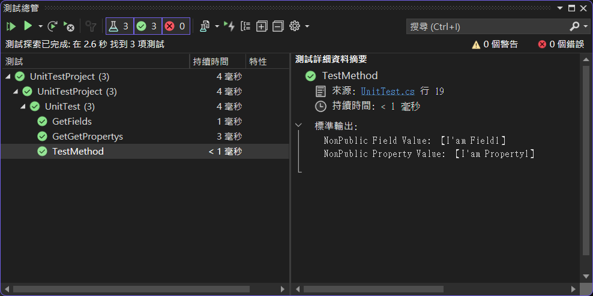
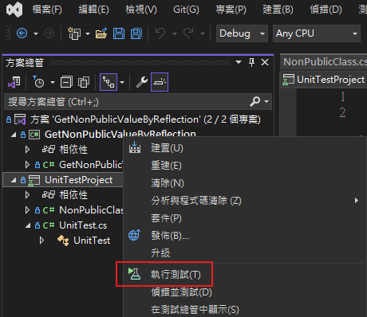

# Get NonPublic Value By Reflection
- 這是一個 .nupkg 專案，並不能直接運行。為了驗證其功能，我們還附上了一個單元測試專案供您進行測試。

在某些情境中，你可能需要取得某些物件的資訊，但這些資訊並非公開。
這時，我們的工具就能派上用場。
只需一行程式碼，就能取得這些非公開的物件資訊。

讓我們以一個例子來說明，假設我們有一個物件，其內容如下：
``` C#
    public class NonPublicClass
    {
        private int NonPublicNumber1 = 1;
        private int NonPublicNumber2 = 2;

        private string NonPublicField1 = "I'am Field1";
        private string NonPublicField2 = "I'am Field2";
        private string NonPublicProperty1 { get; set; } = "I'am Property1";
        private string NonPublicProperty2 { get; set; } = "I'am Property2";
    }
```
假如我們需要取得 NonPublicField 和 NonPublicProperty 的內容，
但不幸的是，它們都是非公開的成員變數。
在這種情況下，我們可以利用這個工具來獲取這些資訊，相關的程式碼如下所示：
``` C#
var npc_ = new NonPublicClass();

var fieldName_ = "NonPublicField1";
string npf_ = GetNonPublicValue.GetFieldValue(npc_, fieldName_) as string;
MSTestLog.WriteLine($"{fieldName_}: 【{npf_}】");

var propertyName_ = "NonPublicProperty1";
string npp_ = GetNonPublicValue.GetPropertyValue(npc_, propertyName_) as string;
MSTestLog.WriteLine($"{propertyName_} Value: 【{npp_}】");
```
只需幾行簡單的程式碼，就能輕鬆獲取非公開的內容。😊

- 測試結果如下圖所示:



- 由於 GetNonPublicValueByReflection 專案為 .nupkg 專案，無法直接執行

測試時，請用單元測試進行測試。



# git commit message
- 常用描述
```
✨ feat: 需求功能描述
🐛 fix: 修正 bug 的問題描述
💄 optimize: 最佳化程式碼或功能流程
🔧 chore: 雜事，例如: 調整設定檔案等等 
```

